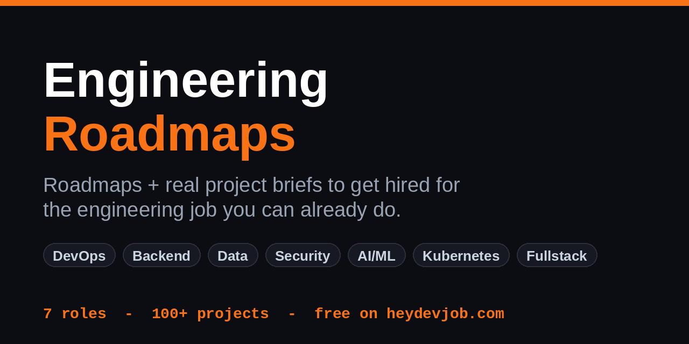
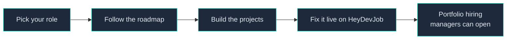

<div align="center">



# Engineering Roadmaps

**Roadmaps and real projects to get hired for the engineering job you can already do.**


[](https://heydevjob.com)

</div>

---

This is an open library of **roadmaps** and **real project briefs** for the roles companies actually hire for - DevOps, Backend, Data, Security, AI/ML, Kubernetes, and Fullstack. Every roadmap is opinionated and outcome-led: not a wall of 400 technologies, but the path that gets you hired and the projects that prove you can do the work.

Each roadmap node links to a real project. Each project shows you the actual broken code, walks you through the approach, and maps to a live workspace on [HeyDevJob](https://heydevjob.com) where you can fix it for real and put it on your portfolio.



## 📂 How it's organized

```
roadmaps/        one roadmap per role - the ordered path from "I can code" to "I got the job"
projects/        real build-and-debug briefs, grouped by role - each proves a specific skill
interview/       interview questions + answers, one file per role - what employers actually ask
checklists/      job-readiness skill checklists, one per role - tick what you can do, prove the rest
cheatsheets/     command references for the tools you use day to day (kubectl, git, docker, sql, linux)
```

Each roadmap node points to the project that proves it. Each project tells you the scenario, what you'll learn, and what it proves on a resume.

## 🧭 The roles

| Role | Roadmap | Projects | Interview | Checklist |
|------|---------|----------|-----------|-----------|
| 🔧 DevOps Engineer | [roadmap](roadmaps/devops.md) | [projects](projects/devops/) | [questions](interview/devops.md) | [checklist](checklists/devops.md) |
| 🔌 Backend Engineer | [roadmap](roadmaps/backend.md) | [projects](projects/backend/) | [questions](interview/backend.md) | [checklist](checklists/backend.md) |
| 🗄️ Data Engineer | [roadmap](roadmaps/data.md) | [projects](projects/data/) | [questions](interview/data.md) | [checklist](checklists/data.md) |
| 🔒 Security Engineer | [roadmap](roadmaps/security.md) | [projects](projects/security/) | [questions](interview/security.md) | [checklist](checklists/security.md) |
| 🤖 AI/ML Engineer | [roadmap](roadmaps/ai.md) | [projects](projects/ai/) | [questions](interview/ai.md) | [checklist](checklists/ai.md) |
| ☸️ Kubernetes Engineer | [roadmap](roadmaps/kubernetes.md) | [projects](projects/kubernetes/) | [questions](interview/kubernetes.md) | [checklist](checklists/kubernetes.md) |
| 🖥️ Fullstack Engineer | [roadmap](roadmaps/fullstack.md) | [projects](projects/fullstack/) | [questions](interview/fullstack.md) | [checklist](checklists/fullstack.md) |

## 📑 Cheatsheets

Quick command references for the tools you reach for on the job:
[kubectl](cheatsheets/kubectl.md) · [git](cheatsheets/git.md) · [docker](cheatsheets/docker.md) · [sql](cheatsheets/sql.md) · [linux](cheatsheets/linux.md)

## 🚀 Build it for real

Reading about a connection-pool leak isn't the same as watching one take down an API at 2am. Every project here maps to a live ticket on [HeyDevJob](https://heydevjob.com) - a real broken production system in a cloud workspace you fix from your browser, no setup. The junior tier is free, no card. Fix it, and it lands on a portfolio hiring managers can open and click.

- **Roadmap** tells you what to learn, in order.
- **Projects** give you something real to build and break.
- **HeyDevJob** is where you do it on a live system and walk away with proof.

## ✅ How to use this

1. Pick your role and open its roadmap.
2. Work top to bottom - the order is deliberate. Junior nodes first, senior last.
3. For each skill, open the linked project. Read the scenario, then go build it.
4. Use the role's checklist to track what you can do unaided, and spot what to learn next.
5. Prep with the role's interview questions before you apply.
6. The projects you finish become your portfolio - real work hiring managers can open.

---

<div align="center">

*Real production work. Real roadmaps. Built so you can show what you've shipped.*

**[Start your portfolio on HeyDevJob →](https://heydevjob.com)**

</div>
