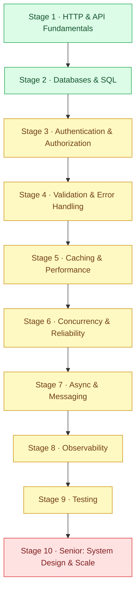

[Home](../README.md) › **Backend Roadmap**

# Backend Engineer Roadmap

`Roadmap` · `10 stages` · `Junior → Senior`

The path from "I can write an endpoint" to "I can design the service" - the skills, in order, that get you hired as a backend engineer and trusted to own production systems.

Backend is a **building** discipline. This roadmap is weighted toward shipping real features - correct, fast, and secure - not just patching broken ones. Every node tells you **what** to learn, **why it matters**, and **how you'd prove it**. The linked project is where you prove it, and each is tagged with what kind of work it is.

> [!NOTE]
> **How to read a node**
> - *What* - the skill in one line
> - *Why it matters* - what breaks in production when you don't have it
> - *Prove it* - the project that turns the skill into a portfolio piece
>
> Each project is tagged with its type: **Build** (create it from nothing), **Debug** (find and fix what's wrong), **Optimize** (make it fast and scalable), **Harden** (make it secure and reliable), **Design** (architect a system). Work top to bottom - the order builds on itself.

---

## 🌐 Stage 1 - HTTP & API Fundamentals

The surface every backend exposes. Get the contract right and everything downstream is easier.

### REST, status codes & response shape
- *What:* Designing endpoints, returning the right 2xx/4xx/5xx, shaping consistent responses.
- *Why it matters:* A wrong status code or inconsistent shape breaks every client. This is the contract the whole system depends on.
- *Prove it:* [Return the Correct HTTP Status Code](../projects/backend/return-the-correct-http-status-code.md) *(Debug)*

### Pagination
- *What:* Returning large collections in pages - offset vs cursor, and why cursor wins at scale.
- *Why it matters:* An endpoint that returns everything falls over the day the table gets big. Pagination is the fix every list endpoint eventually needs.
- *Prove it:* [Switch to Cursor-Based Pagination](../projects/backend/switch-to-cursor-pagination.md) *(Build)*

## 🗄️ Stage 2 - Databases & SQL

The backend's memory. Most performance problems and most bugs live here.

### Indexing & slow queries
- *What:* How indexes work, reading a query plan, when an index helps vs hurts.
- *Why it matters:* The same query is 5ms or 5s depending on one index. Reading `EXPLAIN` is a core backend skill.
- *Prove it:* [Index a Slow Postgres Query](../projects/backend/index-a-slow-postgres-query.md) *(Optimize)*

### The N+1 problem
- *What:* Spotting and killing N+1 query patterns from ORMs and loops.
- *Why it matters:* N+1 is the most common hidden performance killer - one page load firing 200 queries instead of two.
- *Prove it:* [Fix the N+1 Query](../projects/backend/fix-the-n-plus-1-query.md) *(Debug/Optimize)*

## 🔐 Stage 3 - Authentication & Authorization

Who is this, and what are they allowed to do. Get it wrong and it's a breach.

### JWT & sessions
- *What:* Token vs session auth, signing and verifying JWTs, expiry and refresh.
- *Why it matters:* Auth is on every request. A weak verification or a leaked secret is a full account-takeover.
- *Prove it:* [Add JWT Authentication to an API](../projects/backend/add-jwt-authentication.md) *(Build)*

## 🛡️ Stage 4 - Validation & Error Handling

Never trust input. Fail loudly and consistently.

### Input validation
- *What:* Validating and coercing request data at the boundary, rejecting bad input cleanly.
- *Why it matters:* Unvalidated input is where injection, crashes, and corrupt data come from. Validation is the cheapest security you'll ever write.
- *Prove it:* [Add Server-Side Form Validation](../projects/backend/add-server-side-validation.md) *(Harden)*

## ⚡ Stage 5 - Caching & Performance

Make it fast without making it wrong. The hard part is invalidation and limits.

### Cache-aside
- *What:* The cache-aside pattern, TTLs, and the invalidation problem.
- *Why it matters:* A cache turns a 200ms read into 2ms - but a cache you can't invalidate serves stale data forever.
- *Prove it:* [Cache a Hot Read Path With Redis](../projects/backend/cache-a-hot-read-path-with-redis.md) *(Optimize)*

### Rate limiting
- *What:* Token-bucket / sliding-window limiting, per-user and per-endpoint.
- *Why it matters:* Without a limit, one client (or one bug) can exhaust your whole service. Rate limiting is basic survival.
- *Prove it:* [Add a Rate Limiter to an API](../projects/backend/add-a-rate-limiter.md) *(Harden)*

## 🔁 Stage 6 - Concurrency & Reliability

Two requests at once is where correct code becomes incorrect.

### Race conditions
- *What:* Where concurrent requests corrupt state, and fixing them with locks or atomic operations.
- *Why it matters:* "It works in testing" then double-charges a customer under load. Concurrency bugs are invisible until they're expensive.
- *Prove it:* [Stop a Double-Charge Race Condition](../projects/backend/stop-a-double-charge-race-condition.md) *(Debug)*

### Idempotency
- *What:* Making operations safe to retry - idempotency keys, dedup.
- *Why it matters:* Networks retry. Without idempotency, a retried payment charges twice. Every write that matters needs it.
- *Prove it:* [Honor an Idempotency-Key Header on POST](../projects/backend/honor-an-idempotency-key.md) *(Harden)*

## 📨 Stage 7 - Async & Messaging

Not everything happens in the request. Move slow work off the hot path.

### Background jobs & queues
- *What:* Offloading work to queues, workers, retries, dead-letter handling.
- *Why it matters:* Sending email or processing a video in the request thread blocks the user and falls over under load. Async is how real systems stay responsive.

## 📊 Stage 8 - Observability

You can't operate what you can't see. Logs, metrics, traces.

### Structured logging & tracing
- *What:* Structured logs, request tracing, the metrics that matter.
- *Why it matters:* When a request fails in production, observability is the difference between a five-minute fix and a five-hour guess.

## 🧪 Stage 9 - Testing

The safety net that lets you ship fast without breaking things.

### Unit & integration tests
- *What:* What to test, test doubles, integration tests against a real database.
- *Why it matters:* Tests are how you change a system confidently. The senior move is knowing what's worth testing and what isn't.

## 🏛️ Stage 10 - Senior: System Design & Scale

Where you stop writing endpoints and start designing services that scale and stay correct.

### Zero-downtime schema migrations
- *What:* Evolving a live schema with no downtime - expand/contract, backfills.
- *Why it matters:* You can't take production down to add a column. Safe migrations are a senior gate.
- *Prove it:* [Rename a Postgres Column With Zero Downtime](../projects/backend/rename-a-postgres-column-zero-downtime.md) *(Build/Design)*

### Designing for scale
- *What:* Decomposing a system, picking storage, handling load - the system-design interview made real.
- *Why it matters:* "Design a URL shortener / rate limiter / feed" is the senior interview. You design it by having built the pieces.
- *Prove it:* [Design a URL Shortener (System Design)](../projects/backend/design-a-url-shortener.md) *(Design)*

### Distributed transactions
- *What:* Keeping data consistent across services without a global lock - the saga pattern.
- *Why it matters:* The moment you have more than one service, a single transaction won't save you. Sagas are how real distributed systems stay consistent.
- *Prove it:* [Build an Order Saga With Compensating Actions](../projects/backend/build-an-order-saga.md) *(Design)*

---

## 🧭 Where you are on the path

| Stage | You can... | Hiring level |
|-------|-----------|--------------|
| 1-2 | Build correct endpoints backed by a database | 🟢 Junior |
| 3-4 | Ship secure, validated features | 🟢 Junior → 🟡 Mid |
| 5-7 | Make services fast, reliable, and async | 🟡 Mid |
| 8-9 | Operate and test what you build | 🟡 Mid |
| 10 | Design systems that scale and stay consistent | 🔴 Senior |

> [!IMPORTANT]
> **Build it for real**
> Every project linked above is a live ticket on [HeyDevJob](https://heydevjob.com/backend) - a real system in a cloud workspace you build or fix from your browser. The junior tier is free, no card, no setup. Each one you ship lands on a portfolio you can show.
>
> **Start your portfolio →** [heydevjob.com/backend](https://heydevjob.com/backend)

---

**Explore Backend** · [📍 Roadmap](backend.md) · [🛠️ Projects](../projects/backend/README.md) · [💬 Interview](../interview/backend.md) · [✅ Checklist](../checklists/backend.md)
