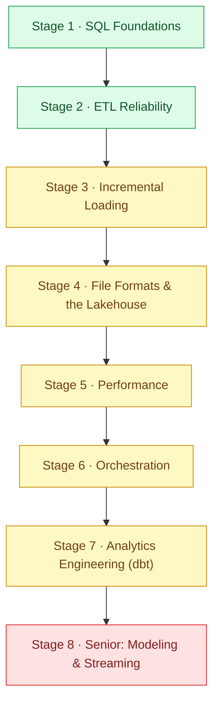

[Home](../README.md) › **Data Roadmap**

# Data Engineer Roadmap

`Roadmap` · `8 stages` · `Junior → Senior`

The path from "I can write a SELECT" to "I can run a pipeline a business depends on" - the skills, in order, that get you hired as a data engineer and trusted with the warehouse.

Data engineering is a **building** discipline: move data correctly, make it fast, and keep it trustworthy. This roadmap follows the real stack - SQL, ETL, file formats, orchestration, dbt, then senior modeling and streaming. Every node tells you **what** to learn, **why it matters**, and **how you'd prove it**, tagged with the kind of work it is.

> [!NOTE]
> **How to read a node**
> - *What* - the skill in one line
> - *Why it matters* - what breaks in a pipeline when you don't have it
> - *Prove it* - the project that turns the skill into a portfolio piece
>
> Type tags: 🔨 **Build** - create the pipeline or model from nothing · 🔍 **Debug** - find and fix wrong data · ⚡ **Optimize** - make it fast · 🛡️ **Harden** - make it reliable and replayable · 📐 **Design** - architect the warehouse (senior).
>
> Work top to bottom. SQL first - everything downstream is built on it.

---

## 🧮 Stage 1 - SQL Foundations

The language of the warehouse. Most data bugs and most performance live here.

### Joins & aggregation correctness
- *What:* Why a one-to-many join inflates a `SUM`, and how to count rows at each stage.
- *Why it matters:* "GROUP BY didn't do what I expected" is the most common SQL bug - usually a fan-out join doubling rows before the aggregate.
- *Prove it:* [Debug a Broken SQL Revenue Aggregation](../projects/data/debug-a-broken-sql-aggregation.md) *(🔍 Debug)*

### Window functions
- *What:* `ROW_NUMBER`/`RANK` over `PARTITION BY` for per-group ranking, running totals, and rolling windows.
- *Why it matters:* Window functions are the most-asked SQL topic after joins - they solve "top N per group" in one declarative pass.
- *Prove it:* [Rank Rows Per Group With Window Functions](../projects/data/rank-rows-with-window-functions.md) *(🔨 Build)*

## 🔁 Stage 2 - ETL Reliability

Pipelines run again and again. They have to survive retries and bad input.

### Idempotency
- *What:* Making a load replayable with UPSERT (`INSERT ... ON CONFLICT`) so a re-run doesn't duplicate.
- *Why it matters:* Network glitches and retries are inevitable. A non-idempotent pipeline doubles rows, and the bad data compounds downstream.
- *Prove it:* [Make an ETL Pipeline Idempotent](../projects/data/make-an-etl-pipeline-idempotent.md) *(🛡️ Harden)*

### Resilience to bad data
- *What:* Skipping and logging malformed rows instead of crashing the whole load.
- *Why it matters:* Real data is always messy. A rigid importer that dies on the first anomaly loses good data and diagnoses nothing.
- *Prove it:* [Make a CSV Importer Resilient to Bad Data](../projects/data/make-a-csv-importer-resilient.md) *(🛡️ Harden)*

## 📈 Stage 3 - Incremental Loading

Don't reload everything every time - load only what changed.

### Watermark-based incremental loads
- *What:* Tracking a watermark and loading only `WHERE created_at > watermark` instead of truncate-and-reload.
- *Why it matters:* Full-load truncation creates a query blackout while the table is empty. Incremental loading keeps the target queryable the whole time.
- *Prove it:* [Implement Incremental Loading in an ETL](../projects/data/implement-incremental-loading.md) *(🔨 Build)*

## 🗂️ Stage 4 - File Formats & the Lakehouse

How data is stored decides how fast and cheap it is to query.

### Columnar formats & partitioning
- *What:* Converting CSV to Parquet with compression and Hive-style partitioning by date.
- *Why it matters:* Parquet is the de facto lake format - every engine reads it. Columnar + partition pruning + compression make queries dramatically faster and storage cheaper.
- *Prove it:* [Convert CSV to Parquet for a Lakehouse](../projects/data/convert-csv-to-parquet.md) *(🔨 Build)*

## ⚡ Stage 5 - Performance

Move more data in less time without changing the result.

### Batch loading
- *What:* Replacing row-by-row inserts with batched `COPY` for orders-of-magnitude throughput.
- *Why it matters:* Single-row insert-and-commit is the worst-case load pattern. Batching moves the bottleneck from network round-trips to the database's bulk path.
- *Prove it:* [Optimize Batch Insert Throughput (COPY)](../projects/data/optimize-batch-insert-with-copy.md) *(⚡ Optimize)*

### Faster dataframes
- *What:* Porting a pandas pipeline to Polars' lazy, multi-core, query-optimized API.
- *Why it matters:* Polars is typically 5-30x faster than pandas for ETL-sized workloads - a free speedup for the same result.
- *Prove it:* [Migrate a pandas Pipeline to Polars](../projects/data/migrate-pandas-to-polars.md) *(⚡ Optimize)*

## 🛠️ Stage 6 - Orchestration

Turning a script into a scheduled, retried, observable pipeline.

### Airflow DAGs
- *What:* Wrapping an ETL in a DAG with task dependencies, scheduling, and retries.
- *Why it matters:* The value over `python3 etl.py` from cron is retries, backfills, dependency visibility, and SLAs - Airflow is the de facto orchestrator.
- *Prove it:* [Schedule a Pipeline as an Airflow DAG](../projects/data/schedule-a-pipeline-with-airflow.md) *(🔨 Build)*

## 🧱 Stage 7 - Analytics Engineering (dbt)

Modeling raw data into trustworthy, tested tables the business can query.

### Staging → marts with dbt
- *What:* The staging (clean) → marts (model) pattern, with sources and tests.
- *Why it matters:* dbt is the dominant analytics-engineering tool. The staging/marts separation, plus lineage and tests, is the modern standard.
- *Prove it:* [Build a Staging-to-Marts dbt Project](../projects/data/build-a-dbt-staging-to-marts-project.md) *(🔨 Build)*

## 🏛️ Stage 8 - Senior: Modeling & Streaming

Designing the warehouse and the always-on pipelines that feed it.

### Dimensional modeling
- *What:* A Kimball star schema - one fact table, conformed dimensions, surrogate keys, tested relationships.
- *Why it matters:* Star schemas make dashboards fast and joins deterministic. Kimball has been the dominant warehouse design since the 90s.
- *Prove it:* [Build a Kimball Star Schema](../projects/data/build-a-kimball-star-schema.md) *(📐 Design)*

### Safe backfills
- *What:* Populating a new column in verified, resumable batches without locking the table.
- *Why it matters:* A money-column backfill is the highest-stakes case - an off-by-100 means a wrong refund. Batched + verified is what separates a senior backfill from an incident.
- *Prove it:* [Backfill a Column Safely (Batched + Verified)](../projects/data/backfill-a-column-safely.md) *(🔨 Build / 📐 Design)*

### Exactly-once streaming
- *What:* A Kafka producer/consumer pair that dedupes so each event is processed exactly once.
- *Why it matters:* Kafka's default is at-least-once - retries deliver duplicates. Dedup-in-consumer is the bread-and-butter pattern for correct streaming.
- *Prove it:* [Build an Exactly-Once Kafka Pipeline](../projects/data/build-an-exactly-once-kafka-pipeline.md) *(📐 Design)*

---

## 🧭 Where you are on the path

| Stage | You can... | Hiring level |
|-------|-----------|--------------|
| 1-2 | Write correct SQL and reliable loads | 🟢 Junior |
| 3-5 | Build incremental, lake-backed, fast pipelines | 🟢 Junior → 🟡 Mid |
| 6-7 | Orchestrate and model data with Airflow and dbt | 🟡 Mid |
| 8 | Design the warehouse and exactly-once streaming | 🔴 Senior |

> [!IMPORTANT]
> **Build it for real**
> Every project linked above is a live ticket on [HeyDevJob](https://heydevjob.com/data) - a real pipeline, query, or model you build or fix in a cloud workspace, from your browser. The junior tier is free, no card, no setup. Each one you ship lands on a portfolio you can show.
>
> **Start your portfolio →** [heydevjob.com/data](https://heydevjob.com/data)

---

**Explore Data** · [📍 Roadmap](data.md) · [🛠️ Projects](../projects/data/README.md) · [💬 Interview](../interview/data.md) · [✅ Checklist](../checklists/data.md)
