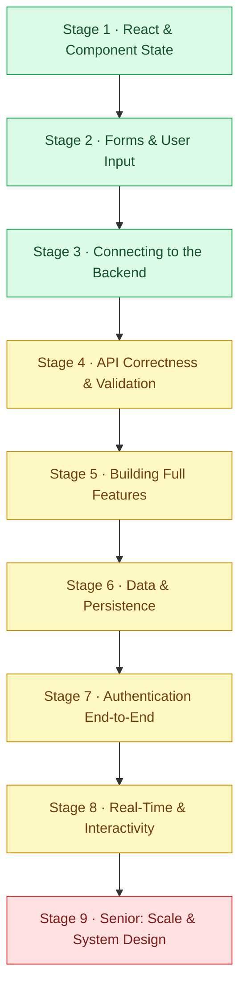

[Home](../README.md) › **Fullstack Roadmap**

# Fullstack Engineer Roadmap

`Roadmap` · `9 stages` · `Junior → Senior`

The path from "I can build a page" to "I can ship the whole feature" - the skills, in order, that get you hired as a fullstack engineer who owns a feature from the database to the browser.

Fullstack is the **end-to-end building** discipline. The hireable signal isn't "I know React" or "I know SQL" - it's "I can take a feature from broken or empty to working in production, every layer." This roadmap is React + an API backend, the stack most fullstack roles actually use. Every node tells you **what** to learn, **why it matters**, and **how you'd prove it**. The linked project is where you prove it on a real feature.

> [!NOTE]
> **How to read a node**
> - *What* - the skill in one line
> - *Why it matters* - what breaks in production when you don't have it
> - *Prove it* - the project that turns the skill into a portfolio piece
>
> Work top to bottom. The order takes you up the stack and back down it.

---

## ⚛️ Stage 1 - React & Component State

State bugs are the most common frontend bugs. Knowing how and when state updates is the core skill.

### State updates & re-renders
- *What:* How `useState` updates batch, stale closures, and the functional updater form.
- *Why it matters:* A "+3 button that only adds 1" is the visible face of stale state - the same bug hides in search boxes, counters, and async callbacks.
- *Prove it:* [Fix a React useState Stale-State Bug](../projects/fullstack/fix-a-react-stale-state-bug.md)

## 📝 Stage 2 - Forms & User Input

The form is where the user talks to your app. Get the defaults right.

### Controlled forms & submit handling
- *What:* `onSubmit`, `preventDefault`, and why the browser's default submit fights React.
- *Why it matters:* A form that reloads the page wipes your state. The same default-action gotcha hits links and drag-and-drop.
- *Prove it:* [Stop the Form From Reloading the Page on Submit](../projects/fullstack/stop-the-form-reloading-on-submit.md)

## 🔌 Stage 3 - Connecting to the Backend

The seam where most fullstack work and most fullstack bugs live.

### Fetch & response shape
- *What:* Calling an API, unwrapping the response, and matching its shape to your UI state.
- *Why it matters:* A shape mismatch (`{data: [...]}` vs `[...]`) is the most common "blank screen" bug there is.
- *Prove it:* [Fix a Blank React Dashboard (Failed Fetch)](../projects/fullstack/fix-a-blank-react-dashboard.md)

### CORS & the browser security model
- *What:* Same-origin policy, preflight, and why CORS is fixed with a response header, not a frontend change.
- *Why it matters:* "It works in curl but not the browser" is the single most common wall fullstack devs hit.
- *Prove it:* [Fix the CORS Error](../projects/fullstack/fix-the-cors-error.md)

## ✅ Stage 4 - API Correctness & Validation

The contract between your frontend and backend. Fail cleanly, not with a 500.

### Validation & status codes
- *What:* Validating required fields and returning the right `4xx` instead of crashing.
- *Why it matters:* A `500` on missing input hides a client mistake behind a scary server error and pages on-call for nothing.
- *Prove it:* [Return 400 on a Missing Field Instead of 500](../projects/fullstack/return-400-instead-of-500.md)

## 🧱 Stage 5 - Building Full Features

The fullstack core: a UI and the API behind it, both yours.

### File upload
- *What:* The browser-to-backend-to-storage upload flow (multipart → server → S3).
- *Why it matters:* Uploads cut across the whole stack and are the most common fullstack-AWS interview question.
- *Prove it:* [Upload Files to AWS S3 From a React Form](../projects/fullstack/upload-files-to-s3-from-react.md)

### CRUD end to end
- *What:* Building create/read/update/delete against a database with parameterized queries.
- *Why it matters:* The CRUD loop - table → SQL → client → UI - is the entry ticket to any data-backed feature.
- *Prove it:* [Wire React to a Database (CRUD)](../projects/fullstack/wire-react-to-a-database-crud.md)

## 🗃️ Stage 6 - Data & Persistence

The queries your UI needs, shaped by how the interface reads data.

### Pagination
- *What:* Cursor pagination for a "Load More" feed - stable when rows shift.
- *Why it matters:* Offset pagination drifts as rows change; cursor pagination is what scales.
- *Prove it:* [Implement Cursor Pagination for a Load More Feed](../projects/fullstack/cursor-pagination-load-more.md)

## 🔐 Stage 7 - Authentication End-to-End

Login that works across the browser and the server.

### JWT login & protected routes
- *What:* Issuing a token on login and verifying it server-side on every protected request.
- *Why it matters:* Hiding a view in the frontend is not security - anyone can call the API directly. The token must be checked on the server.
- *Prove it:* [Add a JWT Login and a Protected Route](../projects/fullstack/add-jwt-login-and-protected-route.md)

## ⚡ Stage 8 - Real-Time & Interactivity

The polish that makes an app feel fast and alive.

### Streaming responses
- *What:* End-to-end SSE streaming - the LLM streams to the server, the server must stream to the browser.
- *Why it matters:* One buffering link kills the whole typing-it-out effect. Streaming is end to end or it isn't.
- *Prove it:* [Stream the AI Chat Response](../projects/fullstack/stream-the-ai-chat-response.md)

### Optimistic UI
- *What:* Updating the UI before the server confirms, and rolling back on failure.
- *Why it matters:* Optimistic updates feel instant (Linear, Gmail) - but forgetting the rollback makes the UI lie about what saved.
- *Prove it:* [Add Optimistic UI With Rollback](../projects/fullstack/add-optimistic-ui-with-rollback.md)

### Real-time broadcast
- *What:* Fanning out messages to every connected client over SSE - per-subscriber queues and cleanup.
- *Why it matters:* "Stored but not broadcast" is the classic real-time bug - data saves but clients never get told.
- *Prove it:* [Build Real-Time Chat Broadcast With SSE](../projects/fullstack/build-realtime-chat-with-sse.md)

## 📐 Stage 9 - Senior: Scale & System Design

Where you own a feature from a vague requirement to a defended design.

### Designing for scale
- *What:* Choosing between architectures (S3 multipart vs client-chunking vs tus) and defending the call.
- *Why it matters:* Every senior interview is "what would you do for X" - pick from plausible options and justify it.
- *Prove it:* [Design a Resumable Large-File Upload](../projects/fullstack/design-a-resumable-file-upload.md)

---

## 🧭 Where you are on the path

| Stage | You can... | Hiring level |
|-------|-----------|--------------|
| 1-2 | Build interactive React UIs and fix state bugs | 🟢 Junior |
| 3-4 | Connect a UI to an API and handle the seam | 🟢 Junior → 🟡 Mid |
| 5-7 | Ship complete features with data, uploads, and auth | 🟡 Mid |
| 8-9 | Add real-time, optimistic UX, and design for scale | 🔴 Senior |

> [!IMPORTANT]
> **Build it for real**
> Every project linked above is a live ticket on [HeyDevJob](https://heydevjob.com/fullstack) - a real feature you build or fix across the stack in a cloud workspace, from your browser. The junior tier is free, no card, no setup. Each one you ship lands on a portfolio you can show.
>
> **Start your portfolio →** [heydevjob.com/fullstack](https://heydevjob.com/fullstack)

---

**Explore Fullstack** · [📍 Roadmap](fullstack.md) · [🛠️ Projects](../projects/fullstack/README.md) · [💬 Interview](../interview/fullstack.md) · [✅ Checklist](../checklists/fullstack.md)
